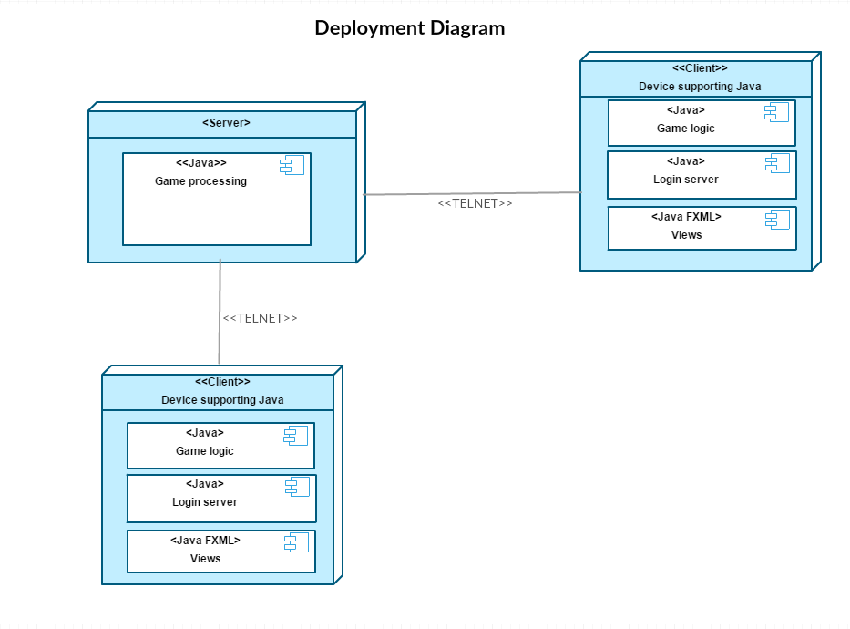
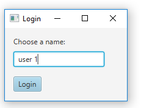
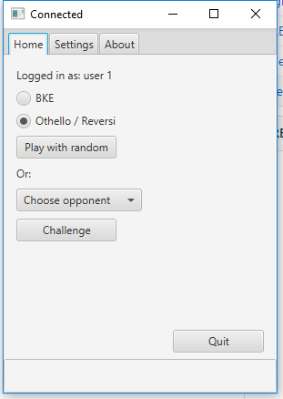
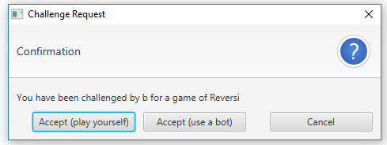
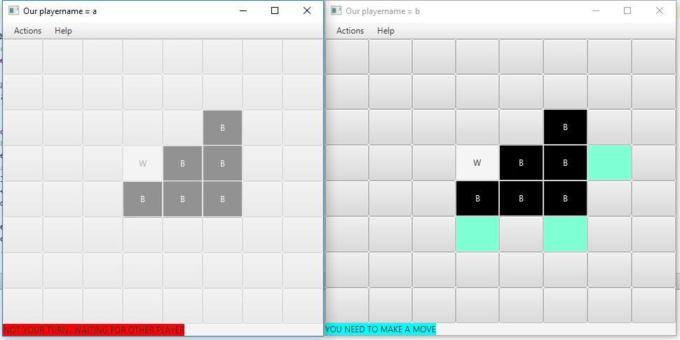

# Game client for Othello & Tic-tac-toe  
# Use Minimax AI to make a bot move
# Provides interaction with a server  
# This is a project for the Hanze University.
For this exercise a game server was provided. This game server is located in build_versions.  
This repo consists of the client that provides a user interface for the server. 
A client connects to the server and is able to play vs other players that are logged in.  
At the end of the school period a Othello tournement is held where the AI bot's play against eachother.  

# Deployment

# Installation: 
  - The build_versions contain all the build versions of this game client repo.
  - The current stable version is 2.0 
  - Run a game server & let clients join the server to play against eachother
  - Run two clients (in a test situation), these will connect to the server
  

# Todo:  
Due to limited time the algorithm the algorithm is going to a depth of 7 and then makes it's best move.  
Some issues still have to be solved, these can be found in git issues.  

# Functionality:
  Login  
    
  Lobby  
    
  Challenging  
    
  Othello game (Player vs. Bot)  
  

